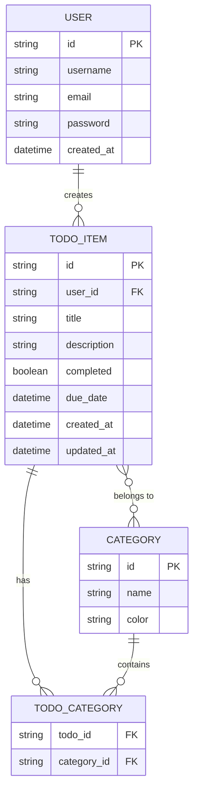

```mermaid
erDiagram
    USER {
        string id PK
        string username
        string email
        string password
        datetime created_at
    }

    TODO_ITEM {
        string id PK
        string user_id FK
        string title
        string description
        boolean completed
        datetime due_date
        datetime created_at
        datetime updated_at
    }

    CATEGORY {
        string id PK
        string name
        string color
    }

    TODO_CATEGORY {
        string todo_id FK
        string category_id FK
    }

    USER ||--o{ TODO_ITEM : "creates"
    TODO_ITEM }o--o{ CATEGORY : "belongs to"
    TODO_ITEM ||--o{ TODO_CATEGORY : "has"
    CATEGORY ||--o{ TODO_CATEGORY : "contains"
```
