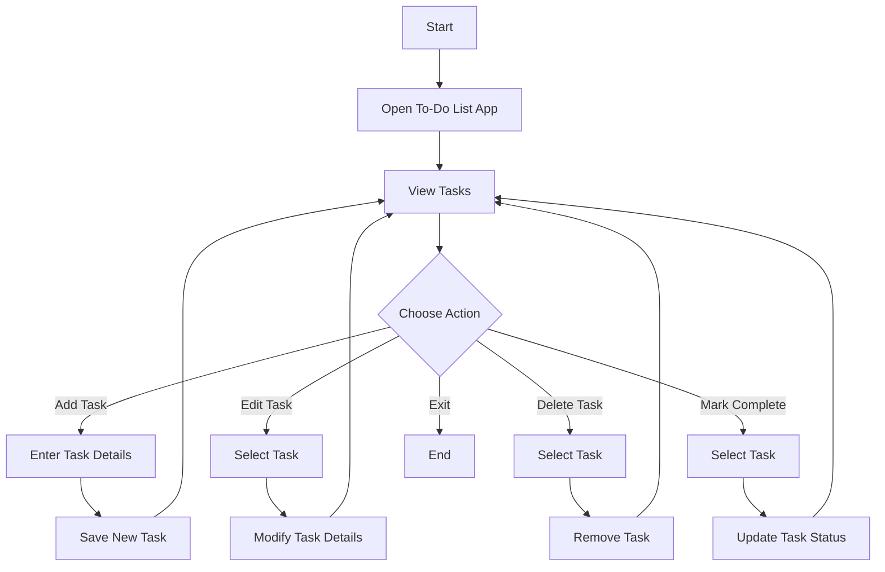

```mermaid
flowchart TD
    A[Start] --> B[Open To-Do List App]
    B --> C[View Tasks]
    C --> D{Choose Action}
    
    D -->|Add Task| E[Enter Task Details]
    E --> F[Save New Task]
    F --> C
    
    D -->|Edit Task| G[Select Task]
    G --> H[Modify Task Details]
    H --> C
    
    D -->|Delete Task| I[Select Task]
    I --> J[Remove Task]
    J --> C
    
    D -->|Mark Complete| K[Select Task]
    K --> L[Update Task Status]
    L --> C
    
    D -->|Exit| M[End]
```